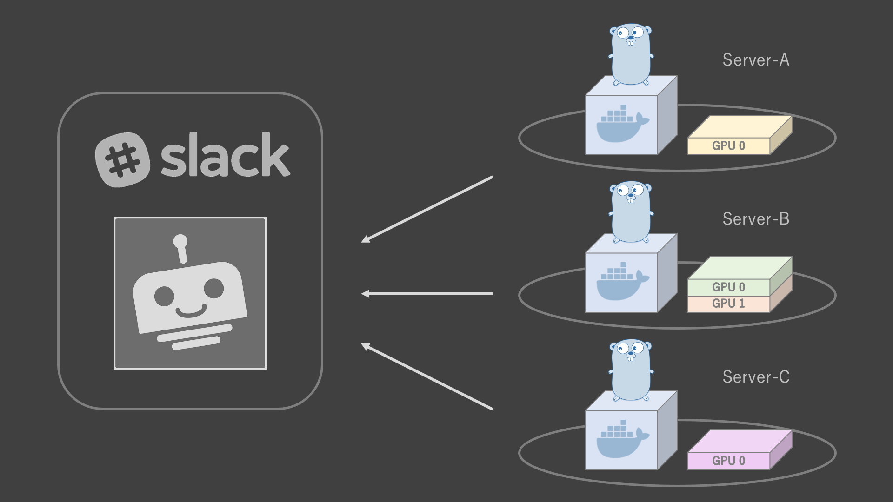
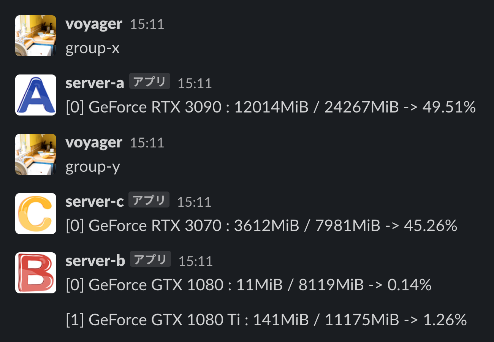

# GPU 使用率監視 Bot 

## 概要
Slack Bot を用いた GPU 使用率監視ツールです. 
確認したいサーバに対応した Bot に問い合わせることで, GPU の使用率の情報を受け取ることができます. 
サーバに予めコンテナを立てておくことで, Slack API からの要求に対して Golang の goroutine 機能を用いた非同期処理を実行します.
なお, コンテナ内部から GPU の情報を参照できるようにするために, サーバに以下の 3 つがインストールされていることを前提としています.

- Nvidia Driver 
- Docker 
- nvidia-docker2




## 設定

### 1. Bot の作成
各サーバを担当する Bot を作成します. 
Slack の App から Bots の追加を行い, API Token を取得してください.
また, Bot の名前は各サーバに対応したものにしてください. 
作成が完了した後は, Bot が活動するチャンネルを作成し「アプリを追加する」から Bot を招待してください. 

### 2. コンテナの起動
各サーバでコンテナを起動します.
起動の前に, src/bot.go 内の Slackparams インスタンスが持つ 3 つの変数を変更しておいてください.

```go
params := Slackparams{
    tokenID:   "aaaaa",     // Slack の API Token
    keyword:   "bbbbb",  // Bot が起動するためのキーワード ( e.g. グループ名 )
    channelID: "ccccc",     // 使用する channel の ID
}
```


## 実行例
今回の例では, 2 つのグループが合計 3 台のサーバを所有しているケースで実行しました. 
各グループのサーバの構成は以下の通りです. 

- Group-X : Server-A (GeForce RTX 3090)
- Group-Y : Server-B (GeForce GTX 1080, GeForce GTX 1080 Ti), Server-C (GeForce RTX 3070)

keyword (group-x, group-y) をそれぞれ入力すると, このような応答が得られます. 



## コマンド

### Docker image の作成
```
$ make build
```

### Docker container の起動
```
$ make run
```

### Docker container の停止
```
$ make stop
```
